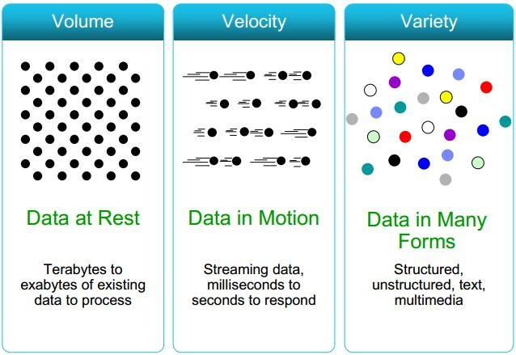
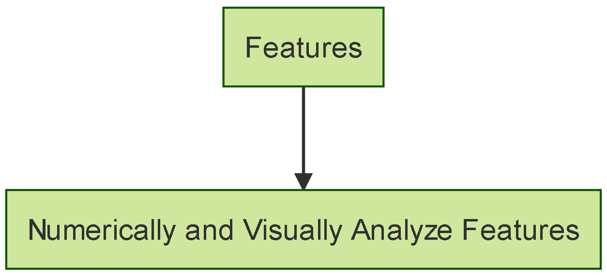
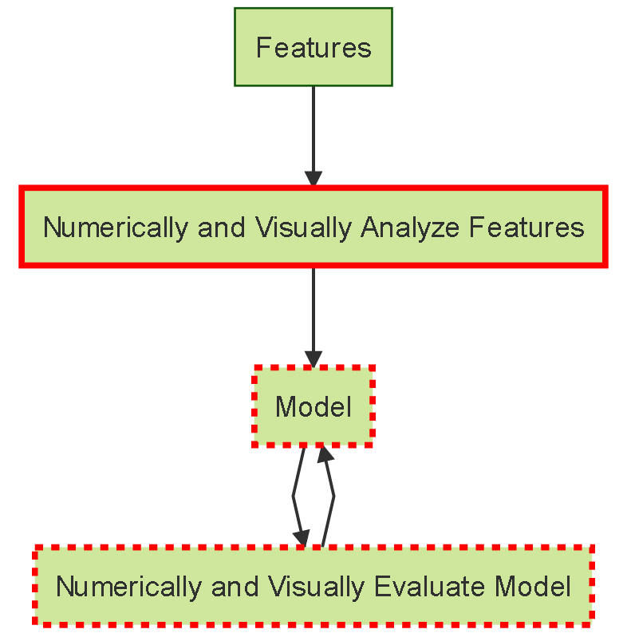

## What Is Big Data? {.centered}


<footer class="source">Source: http://api.ning.com/files/tRHkwQN7s-Xz5cxylXG004GLGJdjoPd6bVfVBwvgu*F5MwDDUCiHHdmBW-JTEz0cfJjGurJucBMTkIUNdL3jcZT8IPfNWfN9/dv1.jpg</footer>

## What's The Goal? {.centered}
<!---
```{r, echo=FALSE}
DiagrammeR::mermaid("
graph TB
A[Understanding The Past]-- >B[Interpreting The Present]
B[Interpreting The Present]-- >C[Predicting The Future]
", width = "800", height = "500")
```
-->


## What's The Dream? {.centered}
The Optimal Implementation Of The Goal
<br><br>
<br><br>
<div style="margin:20px 0px 0px 0px" class="columns-3">
  
  
  
</div>


## What's The Dream? - Processing {.centered}
<!--- Code for generating this image
```{r, echo=FALSE}
DiagrammeR::mermaid("
graph TB
A[Raw Data]-- >B[Data On Cluster]
B[Data On Cluster]-- >C[Features On Cluster]
", width = "800", height = "500")
```
-->


## What's The Dream? - Modeling {.centered}
<!--- Code for generating this image
```{r, echo=FALSE}
DiagrammeR::mermaid("
graph TB
A[Features On Cluster]-- >B[Understand Features]
B[Understand Features]-- >C[Model]
C[Model]-- >D[Numerically and Visually Evaluate Model]
D-- >C
", width = "800", height = "500")
```
-->


## What's The Dream? - Actionable Information
A model that:

1. Consumes raw market/indictive data
2. **Automatically** produces **numerical** and **visual** analyses that **business users** can leverage to make decisions

## What Are We Discussing Today? {.centered}
<!--- Code for generating this image
```{r, echo=FALSE}
DiagrammeR::mermaid("
graph TB
A[Features On Cluster]-- >B[Understand Features]
B[Understand Features]-- >C[Model]
C[Model]-- >D[Numerically and Visually Evaluate Model]
D-- >C

style B stroke:#FF0000, stroke-width: 3, 
style C stroke:#FF0000, stroke-width: 3, stroke-dasharray: 4, 4
style D stroke:#FF0000, stroke-width: 3, stroke-dasharray: 4, 4

", width = "800", height = "500")
```
-->


## I Big Data. Can You? {.centered}


<br><br>
<div class="centered">
  What's wrong with this picture?
</div>
<footer class="source">Source: https://raw.githubusercontent.com/bbouille/start-spark/master/src/spark-shell-standalone.png</footer>

## Our Implementation - DaVinci {.centered}


## Our Implementation - Scatterplot Matrix {.centered}


## What Is Spark Job Server?

"[A] RESTful interface for submitting and managing Apache Spark jobs, jars, and job contexts" (https://github.com/spark-jobserver/spark-jobserver)
<br><br>
<ol>
<li>Create a JAR with an object implementing the SparkJob trait
  <ul>
    sbt ajaxJob/assembly
  </ul>
</li>
<li>Upload to Spark Job Server
  <ul>
    curl --data-binary @ajaxJob.jar jobserver.com:8090/jars/ajaxJob
  </ul>
<li>Call it with AJAX
  <ul>
    curl --d "input.params = param1 ..."
    jobserver.com:8090/jobs?appName=ajaxJob?classPath=path.to.object
  </ul>
</ol>

## Where Does Spark Job Server Fit?

<div class="columns-2">
  <h2>Internally</h2>
  <br><br>
  HTML5 Application
  <br><br>
  Spark Job Server
  <br><br>
  YARN
  <br><br>
  Private Cluster
  <br><br>
  <div style="float:right">
  <h2>Externally</h2>
  <br><br>
  HTML5 Application
  <br><br>
  Spark Job Server
  <br><br>
  Standalone Cluster
  <br><br>
  EC2
  </div>
</div>

## Try Our External Version

<ol>
<li>Clone the repo at https://github.com/David-Durst/spark-jobserver</li>
<li>Run bin/ec2_deploy_and_kmeans.sh</li>
<li>Open the scatterplot matrix in the web browser and enter the URL printed by the script</li>
</ol>

## Create Your Own Internal Version

<ol>
<li>Clone the repo at https://github.com/David-Durst/spark-jobserver</li>
<li>Copy config/local.sh.template to config/internal.sh and modify to fit your environment</li>
<li>Copy config/local.conf.template to config/internal.conf and modify to fit your environment</li>
<li>Run bin/server_deploy.sh internal</li>
</ol>

## {.smallplus}
The following notes should be read in conjunction with the attached document: 

- Issued by BlackRock Investment Management (UK) Limited, authorised and regulated by the Financial Conduct Authority.  Registered office: 12 Throgmorton Avenue, London, EC2N 2DL.  Tel: 020 7743 3000.  Registered in England No. 2020394.  For your protection telephone calls are usually recorded.  BlackRock is a trading name of BlackRock Investment Management (UK) Limited.
- Past performance is not a guide to future performance and should not be the sole factor of consideration when selecting a product. All financial investments involve an element of risk. Therefore, the value of your investment and the income from it will vary and your initial investment amount cannot be guaranteed.  Changes in the rates of exchange between currencies may cause the value of investments to go up and down.  Fluctuation may be particularly marked in the case of a higher volatility fund and the value of an investment may fall suddenly and substantially.  Levels and basis of taxation may change from time to time.
- Mandates we manage may be exposed to finance sector companies, as a service provider or as counterparty for financial contracts.  In recent months, liquidity in the financial markets has become severely restricted, causing a number of firms to withdrawn from the market, or in some extreme cases, becoming insolvent.  This may have an adverse affect on the mandates we manage.
- Any research in this document has been procured and may have been acted on by BlackRock for its own purpose.  The results of such research are being made available only incidentally.  The views expressed do not constitute investment or any other advice and are subject to change.  They do not necessarily reflect the views of any company in the BlackRock Group or any part thereof and no assurances are made as to their accuracy.
- This document is for information purposes only and does not constitute an offer or invitation to anyone to invest in any BlackRock funds and has not been prepared in connection with any such offer.
- This material is for distribution to Professional Clients (as defined by the FCA Rules) and should not be relied upon by any other persons.
- Subject to the express requirements of any client-specific investment management agreement or provisions relating to the management of a fund, we will not provide notice of any changes to our personnel, structure, policies, process, objectives or, without limitation, any other matter contained in this document.
- No part of this material may be reproduced, stored in retrieval system or transmitted in any form or by any means, electronic, mechanical, recording or otherwise, without the prior written consent of BlackRock.
	- UNLESS OTHERWISE SPECIFIED, ALL INFORMATION CONTAINED IN THIS DOCUMENT IS CURRENT AS AT 2015-09-24.

