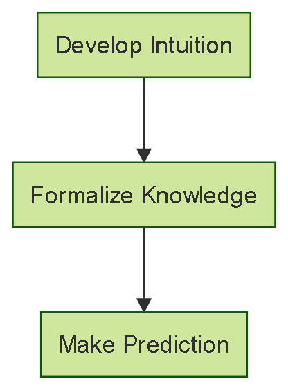
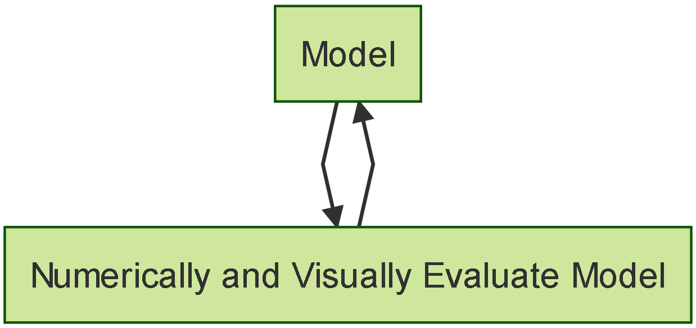
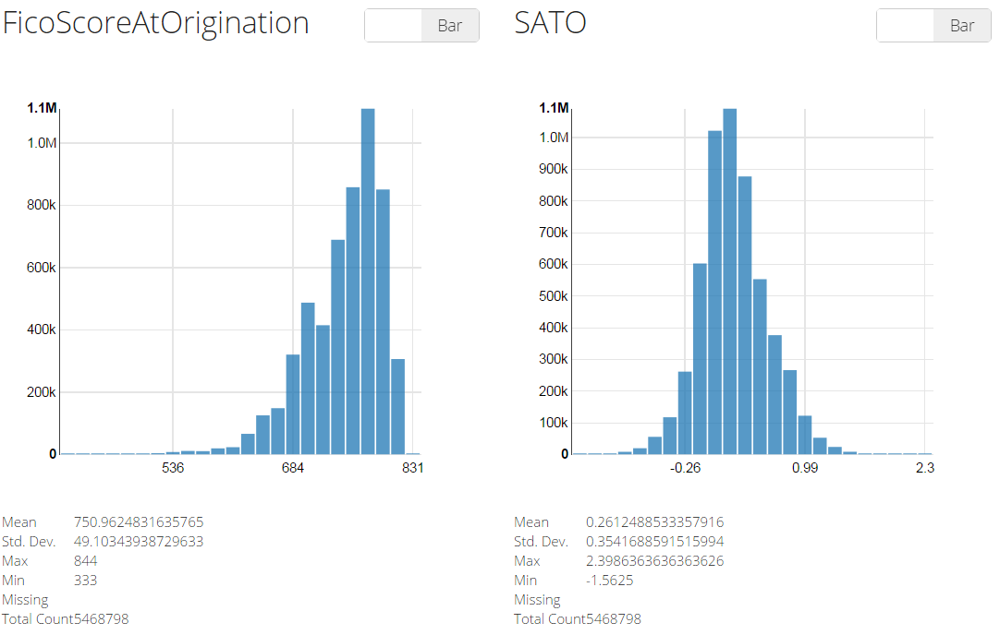

## Who are we?
* Andrew Rothstein - andrew.rothstein@blackrock.com
    + @drewrothstein
    + github.com/andrewrothstein
* Forest Fang - forest.fang@blackrock.com
    + @saurfang86
    + github.com/saurfang
* David Durst - david.durst@blackrock.com
    + @davidbdurst
    + github.com/david-durst

## Who are we?
* BlackRock - "to create a better financial future for our clients"
* Who are our clients?
    + Institutional - banks, insurance companies, pension funds, et. al.
    + Retail - financial advisors, retirees, savers/you
    + Solutions - advisory, Aladdin, et. al.

<footer class="source">https://www.blackrock.com/corporate/en-se/about-us/mission-and-principles
<br>https://en.wikipedia.org/wiki/Financial_market_participants</footer>

## How?
* Aladdin - Software enabled business processes for responsibly operating as an asset manager delivered as service
* A culture of risk management
    + quantitative
    + measure/describe
    + simulate/forecast
* Complex investments require similarly complex financial models to effectively risk manage
* Complex financial models are data hungry beasts that need to be fed and groomed

## How do we build financial models?
* Data, data, data
* Domain knowledge expressed in human directed feature selection
* Visual representations of the data/model to create a feedback loop for the financial modeler
* The Bionic Financial Modeler leverages technology to produce higher quality models
    + engineer for scale and straight-through processing
    + drive down the mean time per iteration
    + more iterations yield deeper understanding of the domain and higher quality financial models

## Why Scala?
* Functional programming allows for succinct expression of complex data processing tasks in composable ways
* The type inferencing system allows for a type-safe scripting-like coding experience
* Spark Scala programs incur limited syntactic ceremony whilst delivering concurrency and parallelism

## Why Spark?
* Spark helps us manage complexity and do so scalably
* We see Spark as a functional successor to all things Hadoop MR.
* The fundamental resilient distributed data structures are fostering a breadth of derived libraries and application integrations that are #awesome
    + DataFrames and SQL
    + MLLib
    + Spark Streaming
    + SparkR

## Please, please, please...
* Make it fast and hide complexity/ceremony from me!
* Make it visual to stimulate my creativity!
* Make this experience a virtuous cycle of machine/human learning!---

# I Big Data And You Can Too

## What Is Big Data? {.centered}


<footer class="source">Source: http://api.ning.com/files/tRHkwQN7s-Xz5cxylXG004GLGJdjoPd6bVfVBwvgu*F5MwDDUCiHHdmBW-JTEz0cfJjGurJucBMTkIUNdL3jcZT8IPfNWfN9/dv1.jpg</footer>

## What Is The Goal? {.centered}
<!--- Code for generating this image
```{r, echo=FALSE, eval=FALSE}
DiagrammeR::mermaid("
graph TB
A[Develop Intuition]-- >B[Formalize Knowledge]
B-- >C[Make Prediction]
", width = "800", height = "500")
```
-->


## What Is The Dream? {.centered}
The Optimal Implementation Of The Goal
<br><br>
<br><br>
<div style="margin:-50px 0px 0px 0px">
  
  <div style="margin:80px 0px 0px 0px" class="column-2">
  
  
  </div>
</div>


## The Dream - Intuition {.centered}
<!--- Code for generating this image
```{r, echo=FALSE, eval=FALSE}
DiagrammeR::mermaid("
graph TB
A[Features]-- >B[Numerically and Visually Analyze Features]
", width = "800", height = "500")
```
-->


## The Dream - Knowledge & Prediction {.centered}
<!--- Code for generating this image
```{r, echo=FALSE, eval=FALSE}
DiagrammeR::mermaid("
graph TB
C[Model]-- >D[Numerically and Visually Evaluate Model]
D-- >C
", width = "800", height = "500")
```
-->


A model that **automatically** produces **accurate forecasts** that **business users** can leverage to make **educated decisions** about the future.

## Where Are We Focusing Today? {.centered}
<!--- Code for generating this image
```{r, echo=FALSE, eval=FALSE}
DiagrammeR::mermaid("
graph TB
A[Features]-- >B[Numerically and Visually Analyze Features]
B-- >C[Model]
C[Model]-- >D[Numerically and Visually Evaluate Model]
D-- >C

style B stroke:#FF0000, stroke-width: 3, 
style C stroke:#FF0000, stroke-width: 3, stroke-dasharray: 4, 4
style D stroke:#FF0000, stroke-width: 3, stroke-dasharray: 4, 4

", width = "800", height = "500")
```
-->


## The Reality {.centered}


<br><br>
<div class="centered">
  What's wrong with this picture?
</div>
<footer class="source">Source: https://raw.githubusercontent.com/bbouille/start-spark/master/src/spark-shell-standalone.png</footer>

## Our Implementation - DaVinci {.centered}



## Our Implementation - Scatterplot Matrix {.centered}


## What Is Spark Job Server?

"[A] RESTful interface for submitting and managing Apache Spark jobs, jars, and job contexts" (https://github.com/spark-jobserver/spark-jobserver)
<br><br>
<ol>
<li>Create a JAR with an object implementing the SparkJob trait
  <ul>
    sbt ajaxJob/assembly
  </ul>
</li>
<li>Upload to Spark Job Server
  <ul>
    curl --data-binary @ajaxJob.jar jobserver.com:8090/jars/ajaxJob
  </ul>
<li>Call it with AJAX
  <ul>
    curl --d "input.params = param1 ..."
    jobserver.com:8090/jobs?appName=ajaxJob?classPath=path.to.object
  </ul>
</ol>


## Try Our External Version {.centered}


## Try Our External Version {.centered}


## Try Our External Version

<ol>
<li>Clone the repo at https://github.com/spark-jobserver/spark-jobserver</li>
<li>Setup AWS CLI</li>
<li>Copy config/user-ec2-settings.sh.template to config/user-ec2-settings.sh and modify to fit your environment</li>
<li>Run bin/ec2_deploy.sh</li>
<li>Run bin/ec2_example.sh</li>
<li>Open the scatterplot matrix in the web browser with the URL printed by the script</li>
</ol>

## Create Your Own Internal Version

<ol>
<li>Clone the repo at https://github.com/spark-jobserver/spark-jobserver</li>
<li>Copy config/local.sh.template to config/internal.sh and modify to fit your environment</li>
<li>Copy config/local.conf.template to config/internal.conf and modify to fit your environment</li>
<li>Run bin/server_deploy.sh internal</li>
</ol>

# Straight-through Build to Spark Analytics

## What People Think We Do! {.centered}


<footer class="source">Source: https://99designs.com/designer-blog/2013/07/19/fantasy-user-interfaces/</footer>

<div class="notes">
- big data team
- data TB size
</div>

## What We Really Do! {.centered}


<footer class="source">Source: http://www.quickmeme.com/p/3vovpz</footer>

<div class="notes">
- dev/debug distributed app is hard
</div>

## Word Count {.centered}

"
<footer class="source">Source: http://www.milanor.net/blog/?p=853</footer>

<div class="notes">
- data processing pipelines: map and reduce
- word count
    - easy to understand
    - difficult to implement
</div>

## Word Count So Easy! (1) {.smaller}

```java
import java.io.BufferedReader;
import java.io.FileReader;
import java.io.IOException;
import java.net.URI;
import java.util.ArrayList;
import java.util.HashSet;
import java.util.List;
import java.util.Set;
import java.util.StringTokenizer;

import org.apache.hadoop.conf.Configuration;
import org.apache.hadoop.fs.Path;
import org.apache.hadoop.io.IntWritable;
import org.apache.hadoop.io.Text;
import org.apache.hadoop.mapreduce.Job;
import org.apache.hadoop.mapreduce.Mapper;
import org.apache.hadoop.mapreduce.Reducer;
import org.apache.hadoop.mapreduce.lib.input.FileInputFormat;
import org.apache.hadoop.mapreduce.lib.output.FileOutputFormat;
import org.apache.hadoop.mapreduce.Counter;
import org.apache.hadoop.util.GenericOptionsParser;
import org.apache.hadoop.util.StringUtils;
```
<footer class="source">Source: http://hadoop.apache.org/docs/current/hadoop-mapreduce-client/hadoop-mapreduce-client-core/MapReduceTutorial.html#Example:_WordCount_v2.0</footer>

## Word Count So Easy! (2) {.smallplus}

```java
public class WordCount2 {

  public static class TokenizerMapper
       extends Mapper<Object, Text, Text, IntWritable>{

    static enum CountersEnum { INPUT_WORDS }

    private final static IntWritable one = new IntWritable(1);
    private Text word = new Text();

    private boolean caseSensitive;
    private Set<String> patternsToSkip = new HashSet<String>();

    private Configuration conf;
    private BufferedReader fis;

    @Override
    public void setup(Context context) throws IOException,
        InterruptedException {
      conf = context.getConfiguration();
      caseSensitive = conf.getBoolean("wordcount.case.sensitive", true);
      if (conf.getBoolean("wordcount.skip.patterns", true)) {
        URI[] patternsURIs = Job.getInstance(conf).getCacheFiles();
        for (URI patternsURI : patternsURIs) {
          Path patternsPath = new Path(patternsURI.getPath());
          String patternsFileName = patternsPath.getName().toString();
          parseSkipFile(patternsFileName);
        }
      }
    }
```

## Word Count So Easy! (3) {.smallplus}

```java

    private void parseSkipFile(String fileName) {
      try {
        fis = new BufferedReader(new FileReader(fileName));
        String pattern = null;
        while ((pattern = fis.readLine()) != null) {
          patternsToSkip.add(pattern);
        }
      } catch (IOException ioe) {
        System.err.println("Caught exception while parsing the cached file '"
            + StringUtils.stringifyException(ioe));
      }
    }

    @Override
    public void map(Object key, Text value, Context context
                    ) throws IOException, InterruptedException {
      String line = (caseSensitive) ?
          value.toString() : value.toString().toLowerCase();
      for (String pattern : patternsToSkip) {
        line = line.replaceAll(pattern, "");
      }
      StringTokenizer itr = new StringTokenizer(line);
      while (itr.hasMoreTokens()) {
        word.set(itr.nextToken());
        context.write(word, one);
        Counter counter = context.getCounter(CountersEnum.class.getName(),
            CountersEnum.INPUT_WORDS.toString());
        counter.increment(1);
      }
    }
  }
```

## Word Count So Easy! (4) {.smalldoubleplus}

```java
  public static class IntSumReducer
       extends Reducer<Text,IntWritable,Text,IntWritable> {
    private IntWritable result = new IntWritable();

    public void reduce(Text key, Iterable<IntWritable> values,
                       Context context
                       ) throws IOException, InterruptedException {
      int sum = 0;
      for (IntWritable val : values) {
        sum += val.get();
      }
      result.set(sum);
      context.write(key, result);
    }
  }
  
  public static void main(String[] args) throws Exception {
    Configuration conf = new Configuration();
    GenericOptionsParser optionParser = new GenericOptionsParser(conf, args);
    String[] remainingArgs = optionParser.getRemainingArgs();
    if (!(remainingArgs.length != 2 | | remainingArgs.length != 4)) {
      System.err.println("Usage: wordcount <in> <out> [-skip skipPatternFile]");
      System.exit(2);
    }
    Job job = Job.getInstance(conf, "word count");
    job.setJarByClass(WordCount2.class);
    job.setMapperClass(TokenizerMapper.class);
    job.setCombinerClass(IntSumReducer.class);
    job.setReducerClass(IntSumReducer.class);
    job.setOutputKeyClass(Text.class);
    job.setOutputValueClass(IntWritable.class);

    List<String> otherArgs = new ArrayList<String>();
    for (int i=0; i < remainingArgs.length; ++i) {
      if ("-skip".equals(remainingArgs[i])) {
        job.addCacheFile(new Path(remainingArgs[++i]).toUri());
        job.getConfiguration().setBoolean("wordcount.skip.patterns", true);
      } else {
        otherArgs.add(remainingArgs[i]);
      }
    }
    FileInputFormat.addInputPath(job, new Path(otherArgs.get(0)));
    FileOutputFormat.setOutputPath(job, new Path(otherArgs.get(1)));

    System.exit(job.waitForCompletion(true) ? 0 : 1);
  }
}
```

## Word Count So Easy? {.centered}


<footer class="source">Source: http://knowledgespeakswisdomlistens.blogspot.com/2013/01/am-i-sheldon-cooper.html</footer>

<div class="notes">
- data processing pipelines: map and reduce
- word count
    - easy to understand
    - substantially easier that building your own distributed data processing engine
    - difficult to implement
</div>

## We Do ... Big ... Data ... {.centered}


<footer class="source">Source: http://www.slideshare.net/ahmaurya/presentation-48235374</footer>

<div class="notes">
- alternative: hive, pig, scalding
- map reduce is slow
</div>

## ... Very ... Slowly ... {.centered}


<footer class="source">Source: http://i.imgur.com/OF87Yiw.jpg</footer>

<div class="notes">
- alternative: hive, pig, scalding
- map reduce is slow
</div>

## ... Then Came Spark!

```scala
val textFile = spark.textFile("hdfs://...")
val counts = textFile.flatMap(line => line.split(" "))
                 .map(word => (word, 1))
                 .reduceByKey(_ + _)
counts.saveAsTextFile("hdfs://...")
```

### 

<div class="centered">
  
</div>

<footer class="source">Source: http://spark.apache.org/</footer>

<div class="notes">
- spark easy to write
- good performance
</div>

## Happy And Productive Data Scientists!

<div class="centered">
  
</div>

<footer class="source">Source: http://www.dispuutcirce.nl/leden/img_2426/</footer>

<div class="notes">
- spark easy to write
- good performance
</div>


## First World Problems! {.centered}


<footer class="source">Source: https://i.imgflip.com/r4xnp.jpg</footer>

<div class="notes">
- submit jobs is the new bottleneck
</div>

## Submit Spark Application {.smaller}

Create application JAR
```
sbt vis/assembly
```

Upload JAR to cluster
```
scp vis/target/scala-2.10/vis-assembly-x.y.z-SNAPSHOT.jar my-awesome-spark-cluster:
```

<div class="centered">
  
</div>

<footer class="source">Source: https://xkcd.com/303/</footer>

<div class="notes">
- build JAR and wait
- copy the JAR and submit
- easy to forget the command
</div>

## Submit Spark Application {.smaller}

The *spark-submit* script in Spark's bin directory is used to launch applications on a cluster.

```bash
# Run application locally on 8 cores
$SPARK_HOME/bin/spark-submit \
  --class org.apache.spark.examples.SparkPi \
  --master local[8] \
  /path/to/examples.jar \
  100

# Run on a Spark Standalone cluster in client deploy mode
$SPARK_HOME/bin/spark-submit \
  --class org.apache.spark.examples.SparkPi \
  --master spark://207.184.161.138:7077 \
  --executor-memory 20G \
  --total-executor-cores 100 \
  /path/to/examples.jar \
  1000
```

- Commands difficult to remember
- No easy way to store different pairs of arguments

<footer class="source">Source: http://spark.apache.org/docs/latest/submitting-applications.html</footer>


## Bash To The Rescue! {.smaller}

```bash
#!/bin/bash

PROJECT_VER=SNAPSHOT
PROJECT_ML_JAR=${PROJECT_DIR}/project-ml-assembly-${PROJECT_VER}.jar

PREFIX=kmeans
HBASE_KEYPREFIX=${PREFIX}_${SUFFIX}
HBASE_CLASSPATH=/etc/hbase/conf:/usr/lib/hbase/lib/hbase-client.jar:/usr/lib/hbase/lib/hbase-common.jar:/usr/lib/hbase/lib/hbase-examples.jar:/usr/lib/hbase/lib/hbase-hadoop2-compat.jar:/usr/lib/hbase/lib/hbase-hadoop-compat.jar:/usr/lib/hbase/lib/hbase-it.jar:/usr/lib/hbase/lib/hbase-prefix-tree.jar:/usr/lib/hbase/lib/hbase-protocol.jar:/usr/lib/hbase/lib/hbase-server.jar:/usr/lib/hbase/lib/hbase-shell.jar:/usr/lib/hbase/lib/hbase-testing-util.jar:/usr/lib/hbase/lib/hbase-thrift.jar:/usr/lib/hbase/lib/htrace-core-2.04.jar

OUTPUT_HDFS_DIR=${PREFIX}/${SUFFIX}

time \
    spark-submit \
    --master yarn-cluster \
    --num-executors 1000 \
    --class com.awesome.ml.KMClustering \
    --driver-class-path ${HBASE_CLASSPATH} \
    --driver-memory=3g --executor-memory=3g \
    --conf="spark.executor.extraClassPath=${HBASE_CLASSPATH}" \
    --conf="spark.yarn.jar=hdfs:///proj/share/spark/spark-assembly-1.5.0-hadoop2.6.0.jar" \
    ${PROJECT_ML_JAR} \
    -output=${OUTPUT_HDFS_DIR} -input=my_awesome_big_dataset \
    -k=10 -partitions=10 -runs=10 \
    -hbase=${HBASE_KEYPREFIX}
```

<div class="notes">
- make it better with bash scripts
- dumping ground
</div>

## Bash Scripting Rocks! {.centered}


<footer class="source">Source: http://memegenerator.net/instance/37544999</footer>

<div class="notes">
- make it better with bash scripts
- dumping ground
</div>

## Bash Scripting Rocks?

- Environment isolation difficult to achieve (repeatability)
- Weak abstraction and encapsulation (code reuse)
- Runtime exception only (reliability)

<div class="centered">
  
</div>
<footer class="source">Source: http://animatedmeme.blogspot.com/2013/06/peter-griffin-vs-blinds.html</footer>

<div class="notes">
- bash bad
    - isolation
    - code reuse
    - reliability
</div>

## Spark Development Challenges

 - Multiple non-instantaneous steps
    - Build, Upload, Submit
 - Multiple main classes
    - Exploratory Analysis, Model Training, Model Evaluation, et. al.
 - Multiple projects
    - Core, Batch ETL, ML, Streaming, Visualization, et. al.
 - Multiple configurations
    - Different Datasets, Parameters, et. al.
 - Multiple deployment locations
    - local, yarn, EC2, et. al.

<div class="notes">
- this is madness
- this is scala
</div>

## Scala! {.centered}


<footer class="source">Source: http://memegenerator.net/instance/58038541</footer>

# *sbt-spark-submit* Plugin to Rescue | Demo: SparkPi Submission for Local and YARN

<footer class="source">Source: https://github.com/saurfang/sbt-spark-submit/tree/master/examples/spark-submit-plugin-test</footer>


<div class="notes">
change deploy strategy on the go;
change settings on the go;
can store multiple configuration;
alter configuration only triggers rebuild the build not the project;
works with multiple main classes
</div>

## Enable *sbt-spark-submit*

`project/plugins.sbt`

```scala
addSbtPlugin("com.github.saurfang" % "sbt-spark-submit" % "0.0.4")
```

`project/SparkSubmit.scala`

```scala
object SparkSubmit {
  lazy val settings =
    SparkSubmitSetting("sparkPi", Seq("--class", "SparkPi"))
}
```

`build.sbt`

```scala
SparkSubmit.settings: _*
```

## Enable *sbt-spark-submit* YARN mode

Add `build.sbt`

```scala
//fill in default YARN settings
enablePlugins(SparkSubmitYARN)
//submit the assembly jar with all dependencies
sparkSubmitJar := assembly.value.getAbsolutePath
//now blend in the sparkSubmit settings
SparkSubmit.settings
```

Set `$HADOOP_CONF_DIR` to pick up YARN configuration


## What is *sbt*?

The interactive build tool

* Use Scala to define your build tasks
* *build.sbt* uses an elegant Scala DSL for build definition 
* *project/\*.scala* use the full power of Scala to configure the build and define custom tasks
* Run your build tasks in parallel from the shell and/or the sbt REPL

<footer class="source">Source: http://www.scala-sbt.org/</footer>

## Why *sbt*?

* Fast incremental build
* Continous compilation/testing
* Concise and powerful configuration
* Built-in auto-complete
* IDE highlights compile time exceptions

## *sbt* is extensible! {.smaller}

`project/plugins.sbt`

```scala
libraryDependencies ++= Seq(
  "com.github.seratch" %% "awscala"          % "0.5.3" excludeAll ExclusionRule(organization = "com.amazonaws"),
  "com.amazonaws"      %  "aws-java-sdk-s3"  % "1.10.1",
  "com.amazonaws"      %  "aws-java-sdk-ec2" % "1.10.1"
)
```

`project/SparkSubmit.scala`

```scala
task.settings(sparkSubmitSparkArgs in task := {
  Seq(
    "--master", getMaster.map(i => s"spark://${i.publicDnsName}:6066").getOrElse(""),
    "--deploy-mode", "cluster",
    "--class", "SparkPi"
  )
}
...
def getMaster: Option[Instance] = {
  ec2.instances.find(_.securityGroups.exists(_.getGroupName == clusterName + "-master"))
}
```

<div class="notes">
- dynamic infer of master hostname
- tap the power of EC2 SDK
</div>

## Scala! {.centered}


<footer class="source">Source: http://www.iamprogrammer.net/</footer>

## Scala! {.centered}


<footer class="source">Source: http://imgur.com/r/programmingmemes/ju1CgAo</footer>

## *sbt* Multi-project Build

- Create tasks specific to each project
- Common settings/tasks are automatically deduplicated
- Tasks are executed in parallel

# Multi-project Build | Demo

<footer class="source">Source: https://github.com/andrewrothstein/hakkalabs-dataeng-conf-20151115/tree/master/movielens-example</footer>

<div class="notes">
task is bind to specific project

automatic common assembly target deduplication;
automatic parallel execution
</div>

## *sbt-spark-submit* Recap

- Streamline build, upload and submit into single task
- Codify *spark-submit* command into settings
- Integrate well for multi-project
- Extensible

# Appendix

## Spark Cluster Mode Overview

> - Driver Program
> - Executors (worker, slave, container)

<div class="centered">
  
</div>

<footer class="source">Source: http://spark.apache.org/docs/latest/cluster-overview.html</footer>

<div class="notes">
Spark applications run as independent sets of processes on a cluster, coordinated by the SparkContext object in your main program (called the driver program).

Driver Program -> Communicate with Cluster Manager to request resources. Broadcast JAR and common files to executors. Sends serialized tasks to executors to run.
Executors -> Listen to Driver for tasks to process and respond with status. Inter-executor communication to exchange shuffled/broadcasted data.
</div>

## Client Deployment Mode {.centered}


<footer class="source">Source: http://www.cloudera.com/content/cloudera/en/documentation/core/latest/topics/cdh_ig_running_spark_on_yarn.html</footer>


<div class="notes">
Client mode runs the Driver Program in the same JVM as *spark-submit*. This has the benefit that logs are shown on the same console. However since Driver Program constantly communicates with Executors, it's often required to run it on a co-located cluster host.
The reality is that Developer often doesn't develops in the same data center as the Hadoop cluster. Wouldn't it be nice if we can submit to a remote cluster right here from our development environment? This is where cluster deployment mode comes in!
</div>


## Cluster Deployment Mode {.centered}

<div class="centered">
  
</div>

<footer class="source">Source: http://www.cloudera.com/content/cloudera/en/documentation/core/latest/topics/cdh_ig_running_spark_on_yarn.html</footer>


<div class="notes">
Cluster mode runs the Driver Program in a container JVM. For the case of YARN, it runs in the same container where Application Master lives. This ensures driver and executers can communicate with low latency.

While logs now can only be retrieved as application logs in YARN, this has the added benefits that logs are automatically archived.
</div>

## {.smallplus}
The following notes should be read in conjunction with the attached document: 

- Issued by BlackRock Investment Management (UK) Limited, authorised and regulated by the Financial Conduct Authority.  Registered office: 12 Throgmorton Avenue, London, EC2N 2DL.  Tel: 020 7743 3000.  Registered in England No. 2020394.  For your protection telephone calls are usually recorded.  BlackRock is a trading name of BlackRock Investment Management (UK) Limited.
- Past performance is not a guide to future performance and should not be the sole factor of consideration when selecting a product. All financial investments involve an element of risk. Therefore, the value of your investment and the income from it will vary and your initial investment amount cannot be guaranteed.  Changes in the rates of exchange between currencies may cause the value of investments to go up and down.  Fluctuation may be particularly marked in the case of a higher volatility fund and the value of an investment may fall suddenly and substantially.  Levels and basis of taxation may change from time to time.
- Mandates we manage may be exposed to finance sector companies, as a service provider or as counterparty for financial contracts.  In recent months, liquidity in the financial markets has become severely restricted, causing a number of firms to withdrawn from the market, or in some extreme cases, becoming insolvent.  This may have an adverse affect on the mandates we manage.
- Any research in this document has been procured and may have been acted on by BlackRock for its own purpose.  The results of such research are being made available only incidentally.  The views expressed do not constitute investment or any other advice and are subject to change.  They do not necessarily reflect the views of any company in the BlackRock Group or any part thereof and no assurances are made as to their accuracy.
- This document is for information purposes only and does not constitute an offer or invitation to anyone to invest in any BlackRock funds and has not been prepared in connection with any such offer.
- This material is for distribution to Professional Clients (as defined by the FCA Rules) and should not be relied upon by any other persons.
- Subject to the express requirements of any client-specific investment management agreement or provisions relating to the management of a fund, we will not provide notice of any changes to our personnel, structure, policies, process, objectives or, without limitation, any other matter contained in this document.
- No part of this material may be reproduced, stored in retrieval system or transmitted in any form or by any means, electronic, mechanical, recording or otherwise, without the prior written consent of BlackRock.
  - UNLESS OTHERWISE SPECIFIED, ALL INFORMATION CONTAINED IN THIS DOCUMENT IS CURRENT AS AT 2015-09-24.

