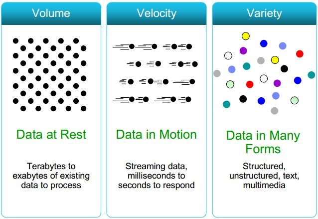
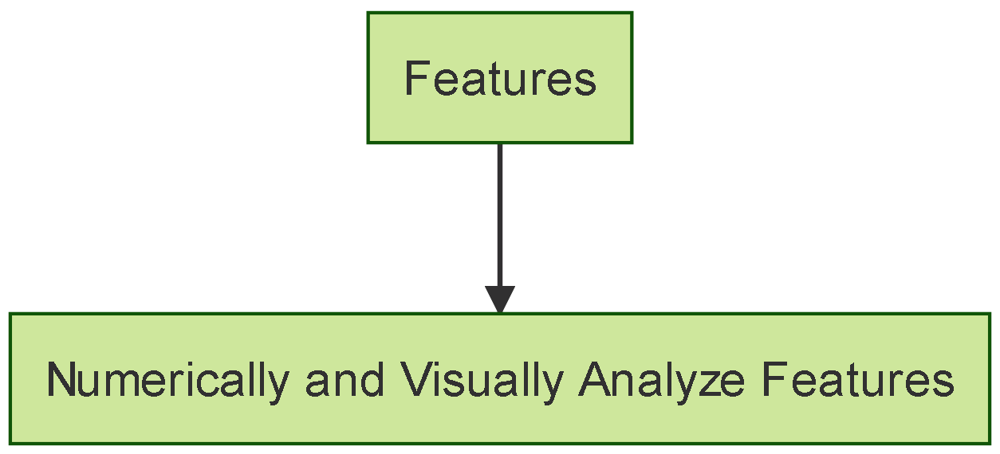
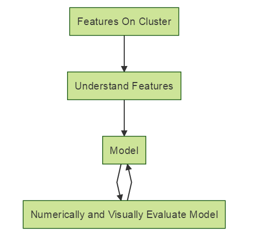
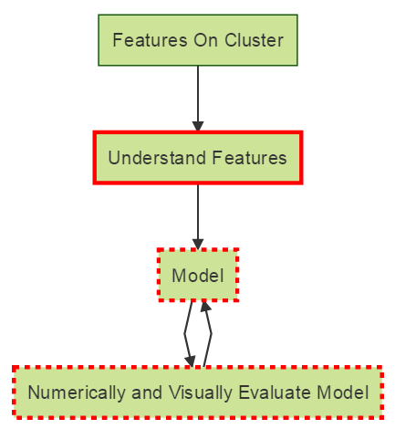
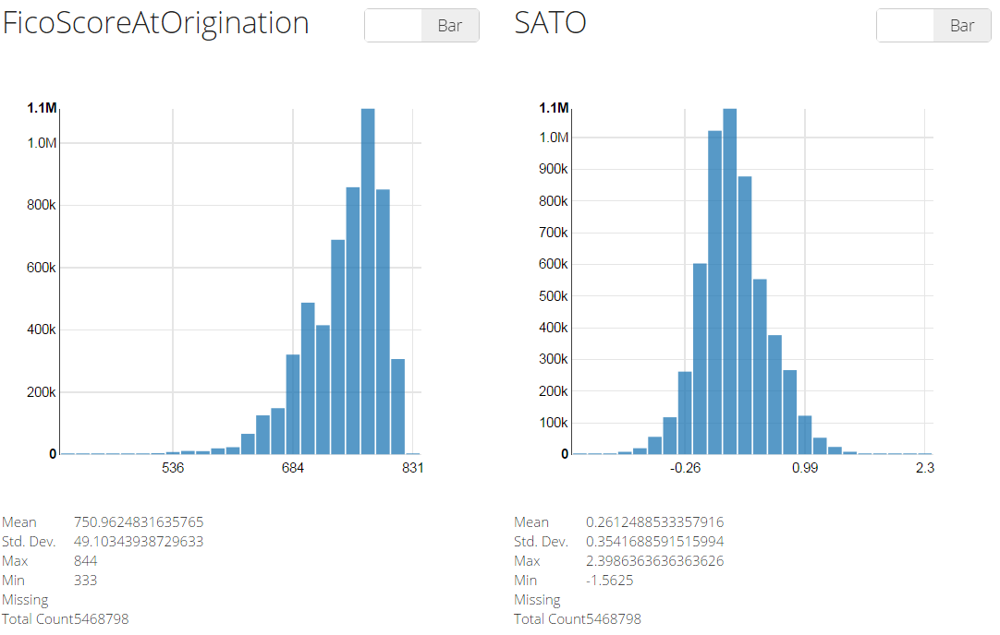
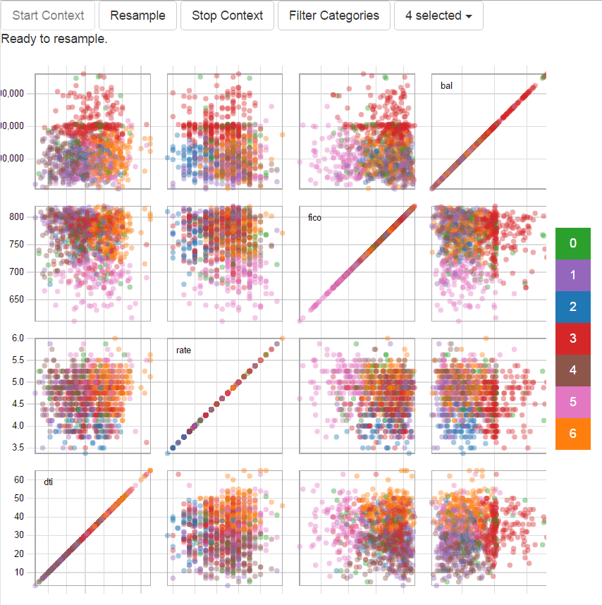

## What Is Big Data? {.centered}


<footer class="source">http://api.ning.com/files/tRHkwQN7s-Xz5cxylXG004GLGJdjoPd6bVfVBwvgu*F5MwDDUCiHHdmBW-JTEz0cfJjGurJucBMTkIUNdL3jcZT8IPfNWfN9/dv1.jpg</footer>

## What's The Goal? {.centered}

```{r, echo=FALSE}
DiagrammeR::mermaid("
graph TB
A[Understanding The Past]-->B[Interpreting The Present]
B[Interpreting The Present]-->C[Predicting The Future]
", width = "800", height = "500")
```

## What's The Dream? {.centered}
The Optimal Implementation Of The Goal
<br><br>
<br><br>
<div style="margin:20px 0px 0px 0px" class="columns-3">
  
  
  
</div>


## What's The Dream? - Processing {.centered}
<!--- Code for generating this image
```{r, echo=FALSE}
DiagrammeR::mermaid("
graph TB
A[Raw Data]-- >B[Data On Cluster]
B[Data On Cluster]-- >C[Features On Cluster]
", width = "800", height = "500")
```
-->


## What's The Dream? - Modeling {.centered}
<!--- Code for generating this image
```{r, echo=FALSE}
DiagrammeR::mermaid("
graph TB
A[Features On Cluster]-- >B[Understand Features]
B[Understand Features]-- >C[Model]
C[Model]-- >D[Numerically and Visually Evaluate Model]
D-- >C
", width = "800", height = "500")
```
-->


## What's The Dream? - Actionable Information
A model that:

1. Takes in raw data
2. AUTOMATICALLY produces NUMERICAL and VISUAL analyses that NON-TECHNICAL individuals can use to make decisions

## What Are We Discussing Today? {.centered}
<!--- Code for generating this image
```{r, echo=FALSE}
DiagrammeR::mermaid("
graph TB
A[Features On Cluster]-- >B[Understand Features]
B[Understand Features]-- >C[Model]
C[Model]-- >D[Numerically and Visually Evaluate Model]
D-- >C

style B stroke:#FF0000, stroke-width: 3, 
style C stroke:#FF0000, stroke-width: 3, stroke-dasharray: 4, 4
style D stroke:#FF0000, stroke-width: 3, stroke-dasharray: 4, 4

", width = "800", height = "500")
```
-->


## I Big Data. Can You? {.centered}


<br><br>
<div class="centered">
  What’s wrong with this picture?
</div>
<footer class="source">https://raw.githubusercontent.com/bbouille/start-spark/master/src/spark-shell-standalone.png</footer>

## Our Implementation - DaVinci {.centered}



## Our Implementation - Scatterplot Matrix {.centered}



## What Is Spark Job Server?

“[A] RESTful interface for submitting and managing Apache Spark jobs, jars, and job contexts.” (https://github.com/spark-jobserver/spark-jobserver)
<br><br>
<ol>
<li>Create a JAR with an object implementing the SparkJob trait
  <ul>
    sbt ajaxJob/assembly
  </ul>
</li>
<li>Upload to Spark Job Server
  <ul>
    curl --data-binary @ajaxJob.jar jobserver.com:8090/jars/ajaxJob
  </ul>
<li>Call it with AJAX
  <ul>
    curl --d “input.params = param1 …”
    jobserver.com:8090/jobs?appName=ajaxJob?classPath=path.to.object
  </ul>
</ol>

## Where Does Spark Job Server Fit?

<div class="columns-2">
  <h2>Internally</h2>
  <br><br>
  HTML5 Application
  <br><br>
  Spark Job Server
  <br><br>
  YARN
  <br><br>
  Private Cluster
  <br><br>
  <div style="float:right">
  <h2>Externally</h2>
  <br><br>
  HTML5 Application
  <br><br>
  Spark Job Server
  <br><br>
  Standalone Cluster
  <br><br>
  EC2
  </div>
</div>

## Try Our External Version

<ol>
<li>Clone the repo at https://github.com/David-Durst/spark-jobserver</li>
<li>Run bin/ec2_deploy_and_kmeans.sh</li>
<li>Open the scatterplot matrix in the web browser and enter the URL printed by the script</li>
</ol>

## Create Your Own Internal Version

<ol>
<li>Clone the repo at https://github.com/David-Durst/spark-jobserver</li>
<li>Copy config/local.sh.template to config/internal.sh and modify to fit your environment</li>
<li>Copy config/local.conf.template to config/internal.conf and modify to fit your environment</li>
<li>Run bin/server_deploy.sh internal</li>
</ol>